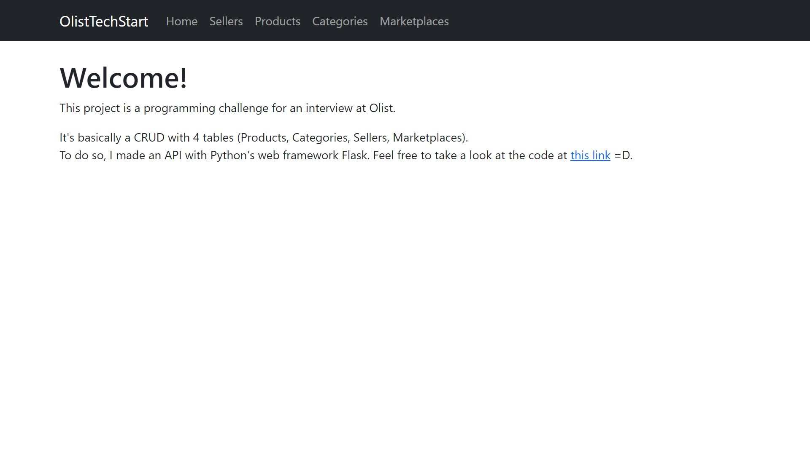
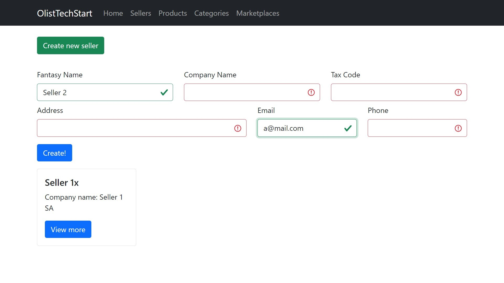
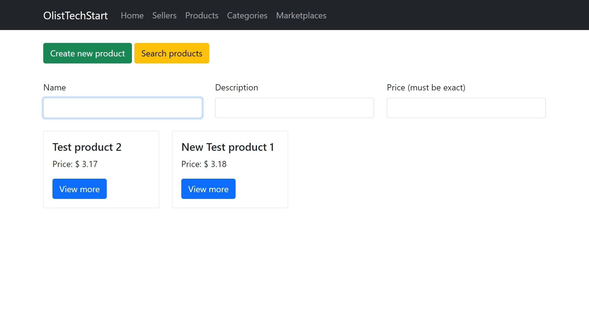

# Olist Tech Start 2nd ed

## Description
This project is a programming challenge for an interview at [Olist](https://github.com/olist). Project complete description and specification (in pt-BR) are in [instructions](instructions.md).

It's basically a CRUD with 4 tables (Products, Categories, Sellers, Marketplaces). To do so, I made an API with Python's web framework Flask.

Project running at [THIS LINK](http://olisttechstart.andrevicente.dev.br/).

### Screenshots

### Files and folder structure
- [settings.py](settings.py) is responsible for the project's settings, with includes configuration variables, extensions and blueprints.
- `migrations` folder is a database migrations folder created and managed by flask-migrate extension
- `requirements` folder contains the project's requirement files
    - [com.txt](requirements/com.txt) have the common dependencies and must be installed
    - [dev.txt](requirements/dev.txt) have the development dependencies
    - [prod.txt](requirements/prod.txt) have the production dependencies
    - [test.txt](requirements/test.txt) have the test dependencies
- `server` folder is a set of scripts to help me put the project on a production server
- `src` folder contains the application itself
    - `app` folder contains the flask app creation and initialization
    - `blueprints` folder contains the application's business rules
        - `api` folder contains the back-end api server
            - [init file](src/blueprints/api/__init__.py)
            - `resources` folder contains the api logic
            - `routes` folder contains the api routes
        - `client` folder contains the webview app
            - `templates` folder contains html (jinja2) pages for the web ui
            - [views file](src/bluprints/client/views.py) are the web ui views that populate and renders the templates
    - `extensions` folder contains third part apps and/or something that does not takes part on business logic
        - `authentication` (unused)
        - `configuration` contains the app configuration setup based on settings file
        - `database` contains the sqlalchemy and migrate initializations
    - `models` contains application database models (tables defined with sqlalchemy)
- `test` folder contains project tests

## Installation

### Requirements
- Git
- Python 3 (tested with 3.9, probably work with 3.6+)
- Python pip
- Python venv
### Steps
- Open terminal
- `git clone https://github.com/isquicha/TechStart_2Ed`
- `cd techstart_2ed`
- `python -m venv .venv`
- Windows: `.venv\Scripts\activate.bat`  Linux: `source .venv/bin/activate`
- `pip install -r requirements/com.txt` (on windows, backslash instead of forward slash)
- `pip install -r requirements/X.txt` with X = [dev, prod, test] for development, production or testing
- Edit `dotenv example.txt` with correct environment variables and rename it to `.env`
- `flask db init`
- `flask db migrate` (run again for every update in models)
- `flask db upgrade` (run again for every update in migrations)
- Run
    - `flask run` in development
    - `gunicorn 'src.app:create_app()'` in production

## Working Environment
The libraries used on this project are on requirements.

### Development setup
#### Hardware
- CPU: Intel Core i5-4440 @ 4x 3.10GHz
- RAM: 12GB DDR3 1600MHz
- Storage: HDD (ST2000DM008)
#### Software
- Operational System: Windows 10
- Python Version: 3.9.1
- Flask version: 1.1.2
- Application Server: Flask embedded server
- IDE: VS Code. Main extensions below:
    - [Python](https://marketplace.visualstudio.com/items?itemName=ms-python.python)
    - [Pylance](https://marketplace.visualstudio.com/items?itemName=ms-python.vscode-pylance)
    - [Python Docstring Generator](https://marketplace.visualstudio.com/items?itemName=njpwerner.autodocstring)
    - [Jinja](https://marketplace.visualstudio.com/items?itemName=wholroyd.jinja)
    - [SQLite](https://marketplace.visualstudio.com/items?itemName=alexcvzz.vscode-sqlite)
    - [Better Comments](https://marketplace.visualstudio.com/items?itemName=aaron-bond.better-comments)
    - [Code Spell Checker](https://marketplace.visualstudio.com/items?itemName=streetsidesoftware.code-spell-checker)
    - [Vscode-icons](https://marketplace.visualstudio.com/items?itemName=vscode-icons-team.vscode-icons)
- Emphasis on those libraries requirements:
    - Black (Python formatter)
        - With "-l 79" parameter
    - Flake8 (Python linter)
### Production setup
#### Hardware
- CPU: Intel Xeon Silver 4114 @ 2x 2.195GHz
- RAM: 1GB
- Storage: 40GB SSD
#### Software
- Operational System: Ubuntu 18.04 bionic
- Python Version: 3.9
- Flask version: 1.1.2
- Application Server: Gunicorn 20.0.4
- Web Server: Nginx 1.14.0
